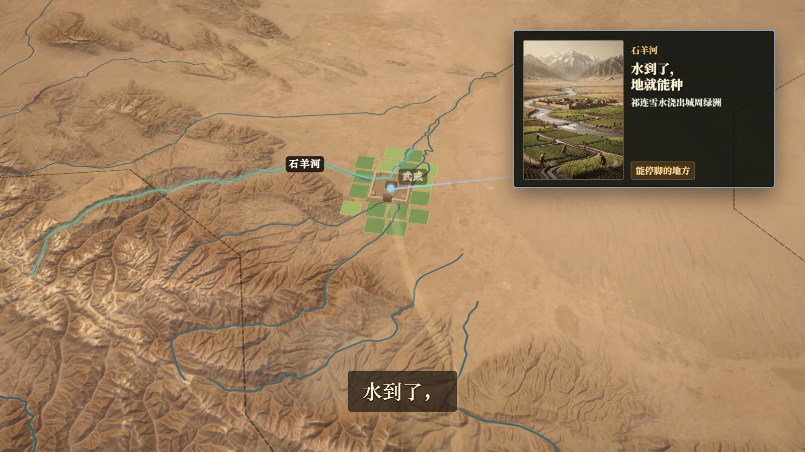
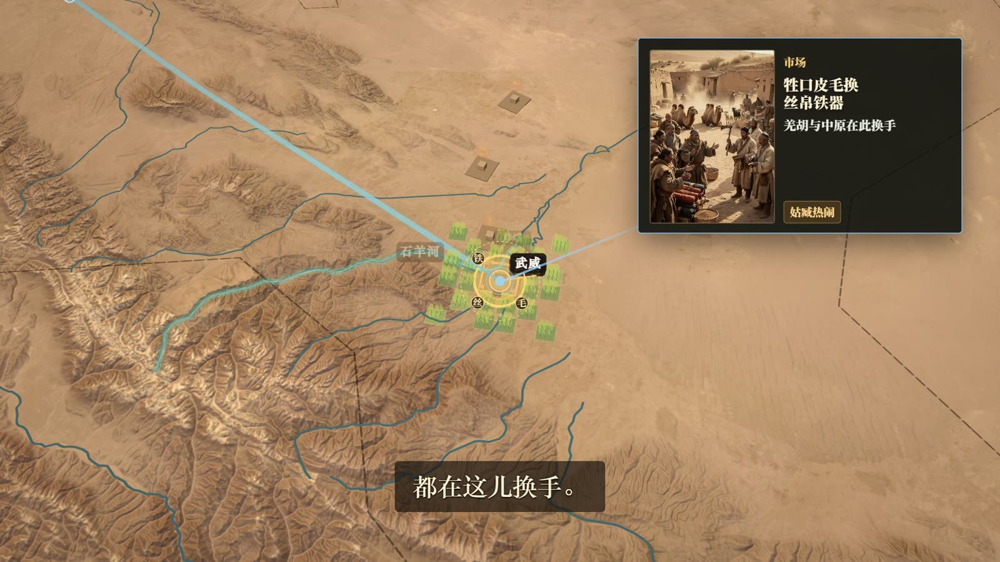

# china-antique-maplibre

[English](README.md) | **中文**

面向中国历史地图与短视频制作的开源 **古卷羊皮纸** MapLibre 方案（HyperFrames 或其他 MapLibre 宿主均可）。

## 在线演示

**交互调参器：** https://hopechen067.github.io/china-antique-maplibre/  
（EOX 卫星底图 + Terrarium 山影需联网。无需安装。）

## 效果展示

作者 **《河西走廊 · 河西四郡》(ep.07)** 成片静帧 + 调参器截图，即本栈目标观感。

<table>
  <tr>
    <td align="center" width="50%">
      
      <br /><sub>武威 · 绿洲 / 石羊河</sub>
    </td>
    <td align="center" width="50%">
      
      <br /><sub>酒泉 · 地形 + 水系</sub>
    </td>
  </tr>
  <tr>
    <td align="center" width="50%">
      
      <br /><sub>河西走廊地图镜头</sub>
    </td>
    <td align="center" width="50%">
      
      <br /><sub>城站近景</sub>
    </td>
  </tr>
  <tr>
    <td align="center" width="50%">
      
      <br /><sub>调参器 · 全国视角 (EOX)</sub>
    </td>
    <td align="center" width="50%">
      
      <br /><sub>调参器 · 河西 / 山影</sub>
    </td>
  </tr>
</table>

更多素材：[marketing/hexi-ep07/](marketing/hexi-ep07/) · 可选短片 [hexi-ep07-map-clip.mp4](marketing/hexi-ep07/hexi-ep07-map-clip.mp4)

| 项目 | 说明 |
|------|------|
| Skill 目录 | `china-antique-maplibre` |
| 运行时 | [MapLibre GL JS](https://maplibre.org/) |
| 默认底图 | **EOX Sentinel-2 cloudless**（公开演示 WMTS；偏非商用条款——成片请换合规源） |
| 地形 / 山影 | AWS Terrarium DEM（运行时拉取；必须 `encoding: 'terrarium'`） |
| 水系 | 全国河湖叠加 `tuner/assets/water-data.js` — **不在 MIT 内**；见 [DATA-PROVENANCE.md](DATA-PROVENANCE.md) |
| 风格 | 古卷 CSS 调参 + 分级城池挤出（`HanCity3D`） |
| 许可证 | 代码/文档 [MIT](LICENSE)，数据与 marketing 有例外 |
| 在线演示 | GitHub Pages → `china-antique-maplibre/tuner`（见 `.github/workflows/deploy-pages.yml`） |

## 快速开始（本机调参）

本地调试或私有瓦片配置时，在本机启动静态服务：

```bash
cd china-antique-maplibre/tuner

# 方式 A — Python 3
python -m http.server 8765

# 方式 B — Node
npx --yes serve -l 8765
```

服务启动后，在**同一台电脑**打开：`http://127.0.0.1:8765/`  
（`localhost` 不是公网演示——分享给别人请用上面的 [在线演示](#在线演示)。）

**不要**用 `file://` 直接打开 `index.html`，预设与水系资源会加载失败。

可选资源检查（需 Node 在 `PATH`）：

```bash
cd china-antique-maplibre/tuner
node verify.mjs
```

## 功能

- **可配置栅格底图** — 默认 [EOX Sentinel-2 cloudless](https://s2maps.eu)（公开演示 + 署名 + 非商用向）。商用高清请用 `map-tiles.config.local.js` 自备合规源。
- **Terrarium 山影 + 地形** — 必须 `encoding: 'terrarium'`。
- **全国水系叠加** — 三级河流 + 湖泊 + 叙事高亮水系（数据条款见 DATA-PROVENANCE.md）。
- **古卷 CSS 调参** — 实时 sepia / 暖调 / 暗角 / 画笔参数；可导出 JSON 预设。
- **城池分级** — 都城 / 大城 / 中城 / 小城 / 关隘 / 驿站 / 都护等（`HanCity3D`）。

## 配置地图瓦片

1. 阅读 [NOTICE.md](NOTICE.md)（第三方服务条款）。
2. 默认配置（`map-tiles.config.js`）为 EOX Sentinel-2 + Terrarium DEM。
3. 国内商用高清卫星请用 gitignore 的 `map-tiles.config.local.js`，填入你有权使用的地址。见 `map-tiles.config.example.js`。

EOX 公共瓦片一般为 **非商用** 并需署名；分辨率约 10 m（非街道级）。本项目 **不** 授予高德 / 谷歌 / Mapbox 等图商权利。

## 营销与参考素材

`marketing/` 目录下：

- `hexi-ep07/` — **河西四郡** 成片静帧 / 短片（见上）  
- `preview-eox-*.png` — 调参器截图  
- 若有其他 hero / 对比图  

仅作本项目 **演示媒体**（见 LICENSE 中 marketing 例外），**不是**可任意商用的免费图库。整集成片 **未** 上传（体积过大）。

## 瓦片不随仓库打包

卫星与 DEM 瓦片 **不** 打进仓库。运行时 MapLibre 只请求你配置的地址（地形开启时含默认 Terrarium）。

## 署名与合规

- **你** 须遵守所用底图、DEM、CDN 在当地与用途下的条款。  
- **水系数据：** 独立于 MIT — [DATA-PROVENANCE.md](DATA-PROVENANCE.md)。  
- **MapLibre / Three.js：** 再分发构建时遵循各自许可证。

## 安装为 Agent Skill

1. 将 `china-antique-maplibre` 复制到 skills 目录（用户级或项目级）。  
2. 重载 agent skills，使 `SKILL.md` 被发现。  
3. 让 agent 应用古卷地图栈 / 打开调参器 / 把导出预设迁入 HyperFrames（或你的宿主）。

## 目录结构

```
.
├── LICENSE
├── NOTICE.md
├── DATA-PROVENANCE.md
├── SECURITY.md
├── README.md              # English
├── README.zh-CN.md        # 中文
├── marketing/             # 演示图 / 静帧
└── china-antique-maplibre/
    ├── SKILL.md
    ├── agents/openai.yaml
    ├── references/
    ├── schemas/
    └── tuner/             # 在线调参页 + 预设 + 资源
```

## 贡献 / 安全

- 优先做小而清晰的改动：预设 schema、调参体验、文档。  
- 不要提交 API key 或 `map-tiles.config.local.js`。  
- 安全报告见 [SECURITY.md](SECURITY.md)。

## 延伸阅读

- [`china-antique-maplibre/SKILL.md`](china-antique-maplibre/SKILL.md) — Agent 入口  
- [`china-antique-maplibre/references/参数列表说明.md`](china-antique-maplibre/references/参数列表说明.md)  
- [`china-antique-maplibre/references/tuner-workflow.md`](china-antique-maplibre/references/tuner-workflow.md)  
- [`china-antique-maplibre/references/tested-config.md`](china-antique-maplibre/references/tested-config.md)  
